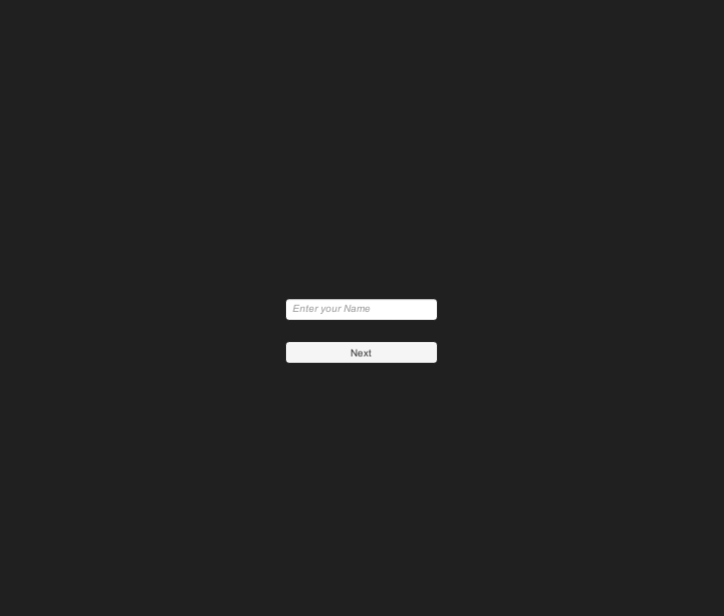
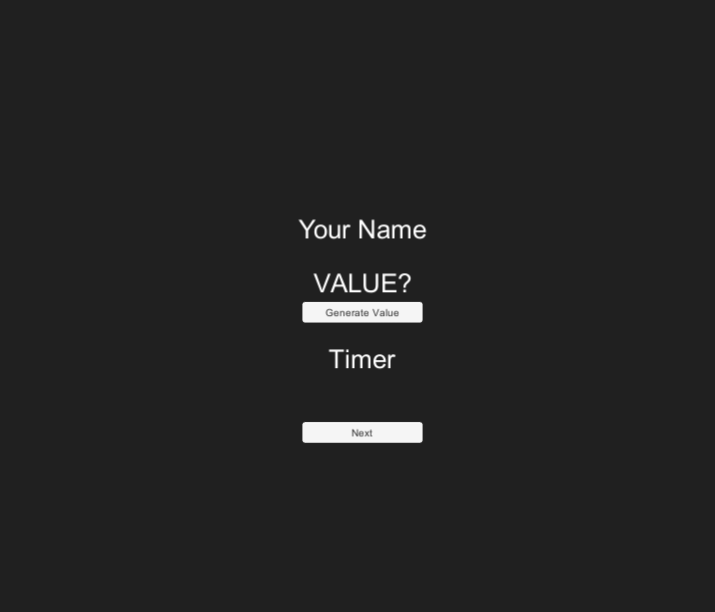
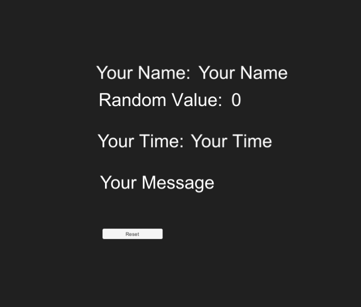

# 06inclass-speedproject-KReisinger

### Project description: 

A speed project inlcuding a name input, random value, Timer, Time message and scriptable objects.

### Development platform: 

* Windows Version	10.0.18363 Build 18363
* Unity Version: 2020.1.5f1
* Visual Studio Code

### Target platform: 

* 2D WebGL (960 x 600 screenindependent)

### Visuals: 

### Necessary setup/execution steps: 

* none

### Third party material:
 
* none

### Project state: 

* 100%

### Limitations: 

* none

### Lessons Learned: 

* scriptable object

Copyright by Kilian
